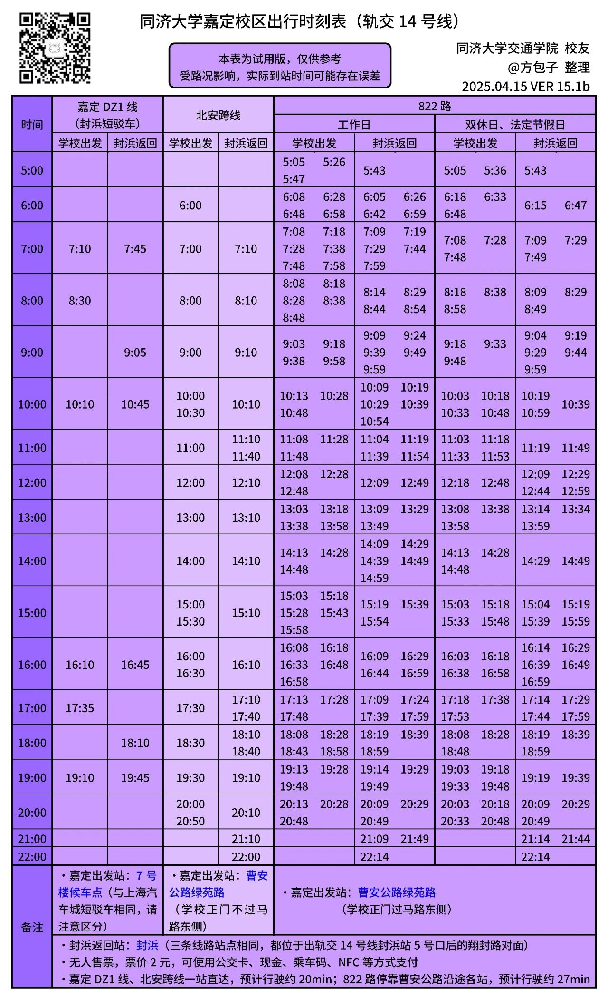
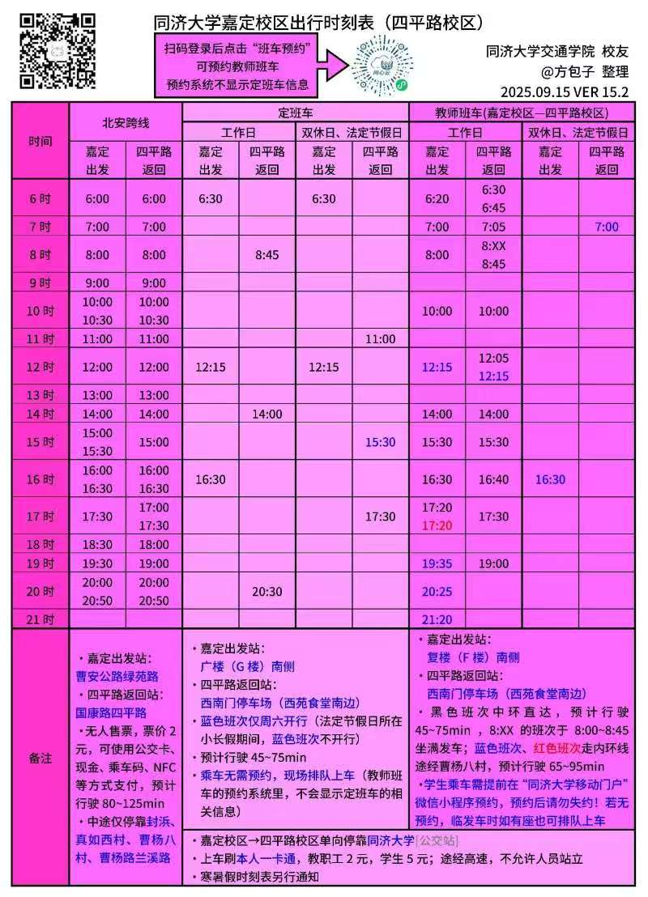

# **同济嘉定校区通勤分析系统 \- 前端功能设计方案**

## **1\. 核心功能模块规划**

### **模块一：智能出行决策看板 (The Decision Maker)**

这是最核心的功能，直接解决“我该坐11号线还是14号线”的问题。

* **功能描述**：
  * 用户选择出发时间（例如：周五 16:30）。
  * 系统自动对比两条路径：
    * **路径 A (经典拥挤线)**：嘉定校区 \-\> 112/短驳 \-\> 汽车城 \-\> 11号线 \-\> 真如。
    * **路径 B (新晋舒适线)**：嘉定校区 \-\> DZ1/822 \-\> 封浜 \-\> 14号线 \-\> 真如。
  * **展示内容**：预计耗时、拥挤指数（红/绿颜色区分）、换乘步行步数。
* **前端实现思路 (如何“编”得像真的)**：
  * **数据构造**：在前端写一个大的 JSON 配置文件，把 11 号线和 14 号线的每小时拥挤系数写死。
    * *例如*：11号线在 8:00-9:00 系数是 0.95 (深红)，14号线是 0.4 (浅绿)。
  * **逻辑计算**：
    // 伪代码逻辑
    const congestion11 \= getMetroData(11, userTime); // 获取11号线拥挤度
    const busWaitTime \= calculateNextBus(userTime); // 算下一班短驳车还要多久
    const totalScore \= (congestion11 \* 权重) \+ busWaitTime;
    // 比较两条线的分数，分数低的推荐显示 "Recommended" 标签

### **模块二：校车/公交动态倒计时 (The Live Scheduler)**

利用你上传的图片时刻表，做一个动态的倒计时牌，这非常实用且直观。

* **功能描述**：
  * 界面左侧展示“下一班车”倒计时。
  * 涵盖线路：北安跨线、822路、短驳车、DZ1。
  * **亮点**：如果下一班车是 822（容易堵车），可以给它加一个“拥堵预警”的小图标。
* **前端实现思路**：
  * 时刻表数字化：把你图片里的时间点转换成数组：const schedule822 \= \['06:00', '06:20', ...\];
  * **倒计时算法**：
    * 获取当前系统时间 new Date()。
    * 遍历数组，找到第一个大于当前时间的班次。
    * Diff \= 班次时间 \- 当前时间，实时刷新显示。

### **模块三：拥挤程度热力地图 (The Heatmap)**

这是展示数据库工作量的最佳方式。

* **功能描述**：
  * 一张简化的路线地图，上面画着 11 号线和 14 号线。
  * 线路的颜色会根据时间轴拖动而变化（绿色流畅 \-\> 红色拥堵）。
  * **重点展示**：
    * **11号线（安亭-南翔段）**：常年标红（体现拥挤）。
    * **14号线（封浜-真如段）**：常年标绿（体现舒适）。
    * **短驳车路段**：根据早晚课时间变色。
* **技术栈推荐**：
  * **ECharts** 的路径图（Lines 3D 或普通的 Graph），或者直接用 CSS 画两条粗线，通过 transition 属性控制颜色的渐变，效果也很炫酷且开发成本低。

## **2\. 页面布局与交互设计 (UI/UX)**

建议采用**Dashboard (仪表盘)** 布局，显得专业且数据量大。

### **顶部导航**

* 标题：**上海轨道交通流量分析与同济出行辅助系统**
* 控件：
  * \[日期选择器\] (工作日/双休日 \- 对应你不同的时刻表)
  * \[时间滑块\] (06:00 \- 23:00，拖动滑块，下面的图表跟着动)

### **左侧：出行推荐卡片 (Card View)**

* **卡片 A (11号线)**：
  * 图标：🚇 11
  * 状态：⚠️ 拥挤 (座位概率 \< 10%)
  * 接驳：校车 (下一班 5 mins)
* **卡片 B (14号线)**：
  * 图标：🚇 14 (🌟 推荐)
  * 状态：✅ 舒适 (座位概率 \> 90%)
  * 接驳：北安跨线 (下一班 12 mins)

### **中间：可视化大屏 (Visual Center)**

* 使用 ECharts 绘制**折线图对比**。
  * X轴：时间。
  * Y轴：客流量/拥挤度。
  * 两条线：红线代表11号线流量，蓝线代表14号线流量。
  * *注解*：可以标出“早八高峰”、“晚课结束”等特殊时间点（体现是针对学校定制的）。

### **右侧：短驳时刻表详情**

* 用表格或列表展示你图片里的具体发车时间。
* 高亮显示当前时间段内的班次。

## **3\. 关键代码逻辑实现 (Cheat Sheet)**

### **A. 如何模拟“拥挤度”数据 (Mock Data)**

既然数据库还没完全对接，前端可以先构造模拟数据。
// mockData.js
// 模拟一天中每小时的拥挤指数 (0-100)
export const congestionData \= {
  line11: \[10, 20, 80, 95, 80, 40, 30, 40, 90, 80, ...\], // 早晚高峰很堵
  line14: \[5, 10, 40, 50, 40, 20, 15, 20, 45, 40, ...\]  // 相对较空
};

// 获取特定时间的拥挤度
export const getCongestion \= (hour, line) \=\> {
  return congestionData\[line\]\[hour\];
};

### **B. 时刻表处理 (处理你上传的图片数据)**

把图片里的数据硬编码进代码里。
// busSchedule.js
export const schedules \= {
  // 仅示例，数据需根据图片录入
  beiAn: {
    weekday:\['06:30', '06:50', '07:10', ...\],
    weekend:\['07:00', '07:30', ...\]
  },
  line11\_shuttle: {
    // ...
  }
};

## **4\. 给演示汇报的加分话术 (Tips)**

在演示前端界面时，记得强调以下几点，能极大地拔高项目立意：

1. **“多源数据融合”**：“我们在前端不仅展示了地铁数据，还融合了校车时刻表和公交实时预估，打通了校园出行的‘最后一公里’。”
2. **“算法辅助决策”**：“系统通过加权算法（时间成本+拥挤成本），为嘉定师生提供了从‘忍受拥挤’到‘享受通勤’的最优解切换（即引导大家去坐14号线）。”
3. **“交互式分析”**：“拖动顶部的时间轴，我们可以看到安亭站在早高峰瞬间变红，而同时间段的封浜站依然保持绿色，直观验证了我们的分流策略是有效的。”

## **5\. 技术栈建议**

* **框架**:  Vue (上手快，组件化)。
* **UI库**: Ant Design (React) 或 Element Plus (Vue) \- 快速搭建漂亮的表格和卡片。
* **图表库**: **ECharts** (必选，老师最认这个，做折线图和地图很强)。
* **图标**: FontAwesome 或 iconfont \- 找一些地铁、巴士、行人的小图标点缀界面。
